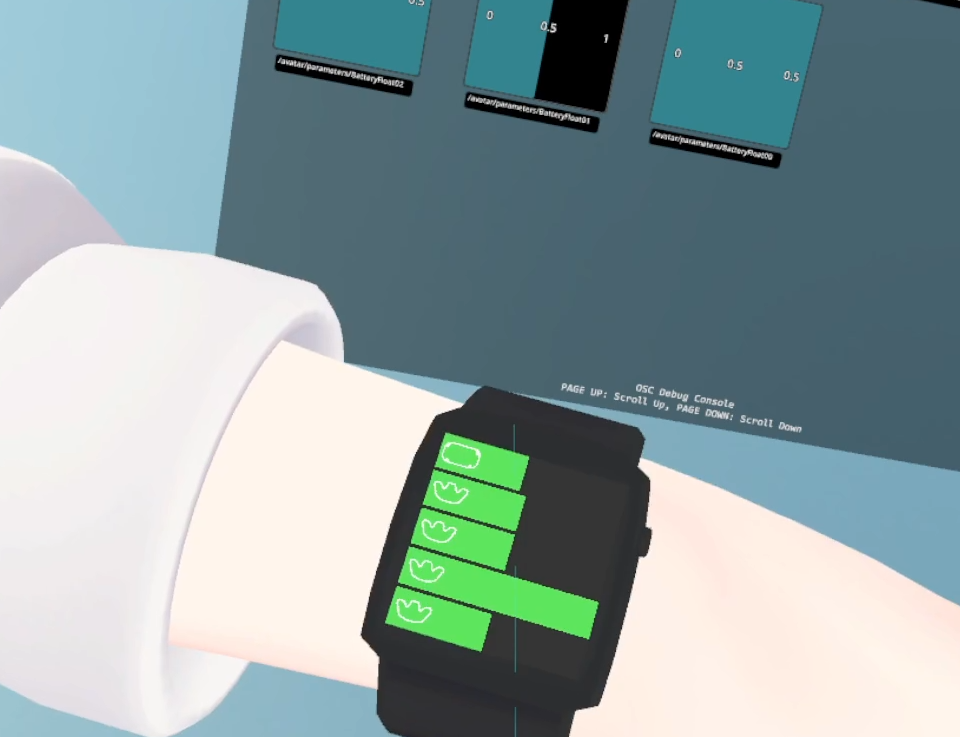

デバイスのバッテリー残量をOSCで送信します。
 
スロットが複数あり、送信先アドレスは次の通りです。
 
Slot 0 -> "/avatar/parameters/BatteryFloat00"
 
Slot 1 -> "/avatar/parameters/BatteryFloat01"
 
Slot 2 -> "/avatar/parameters/BatteryFloat02"
 

SteamVR環境で動作します。
 
スロットにセットしたデバイスは保存されます。次回起動時にはアプリがデバイスを検出すると自動的にセットされます。
 
SteamVRがデバイスを認識してから本アプリケーションがデバイスを取得できるまで時間を要することがあります。
 
※特にトラッカーが遅い！！
 

動く
 
・Meta Quest 3 Virtual Desktop 
 
・Thundra Tracker
 
・Vive Tracker

動かない
 
・Meta Quest 3 Controller
 
・Meta Quest 3 Quest Link (有線・無線)

多分動く
 
・Meta Quest 2 Virtual Desktop
 
・Index Controller
 
・Vive Controller

わからない
 
・上に記載のない全てのデバイス

使用例↓ SampleModel以下にサンプルモデルあります。

おまけ
 
以下の設定をするとSwitchBot温湿度計から取得した情報を送信します。 APIは1分に1回呼んでます
 
システム環境変数
 
・sai-osc-SBSecret : 「クライアントシークレット」
 
・sai-osc-SBToken : 「トークン」
 
・sai-osc-SBMeterID : 「温湿度計のデバイスID」
 
温度は0 ~ 50度の範囲を(float)0 ~ 1 (avatar/parameters/Humidity)
 
湿度は0 ~ 100%の範囲を(float)0 ~ 1 (avatar/parameters/Temperature)
