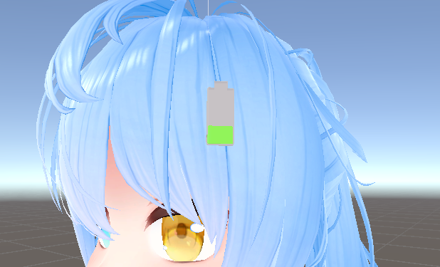
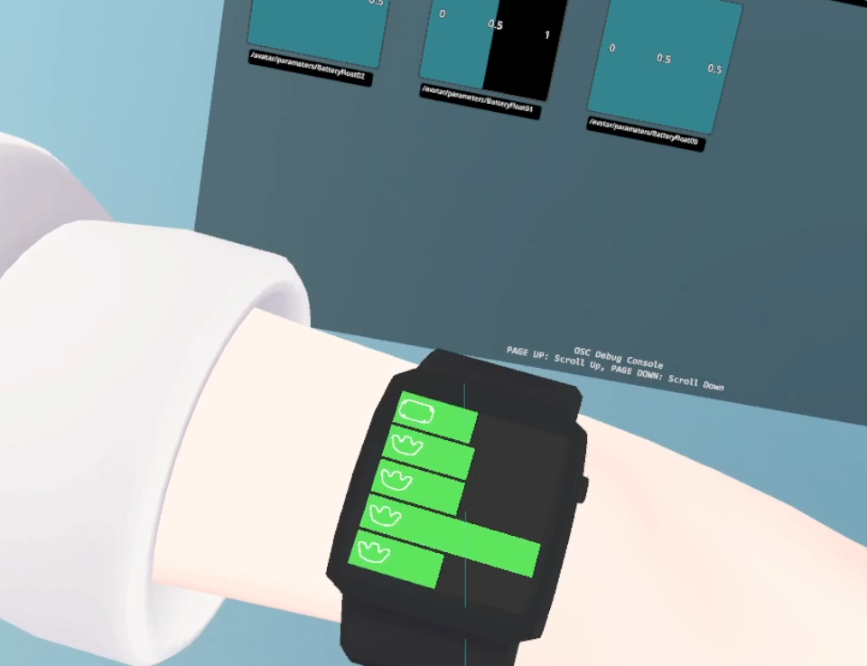

デバイスのバッテリー残量をOSCで送信します。
<br>
スロットが複数あり、送信先アドレスは次の通りです。
<br>
Slot 0 -> "/avatar/parameters/BatteryFloat00"
<br>
Slot 1 -> "/avatar/parameters/BatteryFloat01"
<br>
Slot 2 -> "/avatar/parameters/BatteryFloat02"
<br>


SteamVR環境で動作します。
<br>
スロットにセットしたデバイスは保存されます。次回起動時にはアプリがデバイスを検出すると自動的にセットされます。
<br>
SteamVRがデバイスを認識してから本アプリケーションがデバイスを取得できるまで時間を要することがあります。
<br>
※特にトラッカーが遅い！！
<br>

動く
<br>
・Meta Quest 3 Virtual Desktop 
<br>
・Thundra Tracker
<br>
・Vive Tracker

動かない
<br>
・Meta Quest 3 Controller
<br>
・Meta Quest 3 Quest Link (有線・無線)

多分動く
<br>
・Meta Quest 2 Virtual Desktop
<br>
・Index Controller
<br>
・Vive Controller

わからない
<br>
・上に記載のない全てのデバイス

使用例↓ SampleModel以下にサンプルモデルあります。




おまけ
<br>
以下の設定をするとSwitchBot温湿度計から取得した情報を送信します。 APIは1分に1回呼んでます
<br>
システム環境変数
<br>
・sai-osc-SBSecret : 「クライアントシークレット」
<br>
・sai-osc-SBToken : 「トークン」
<br>
・sai-osc-SBMeterID : 「温湿度計のデバイスID」
<br>
温度は0 ~ 50度の範囲を(float)0 ~ 1 (avatar/parameters/Humidity)
<br>
湿度は0 ~ 100%の範囲を(float)0 ~ 1 (avatar/parameters/Temperature)

## VRChat Google Assistant Integration (via Dialogflow)

This feature allows you to send commands from VRChat via OSC to your Google Cloud Dialogflow ES agent, enabling control of home appliances or other actions you configure in Dialogflow.

### Prerequisites

1.  **Google Cloud Platform (GCP) Project:**
    *   Create a new GCP Project or use an existing one in the [Google Cloud Console](https://console.cloud.google.com/).
2.  **Enable Dialogflow API:**
    *   In your GCP Project, navigate to "APIs & Services" > "Library".
    *   Search for "Dialogflow API" and enable it.
3.  **Create a Dialogflow ES Agent:**
    *   Go to the [Dialogflow ES Console](https://dialogflow.cloud.google.com/).
    *   Create a new agent or use an existing one.
    *   Within this agent, you will define intents (e.g., "TurnOnLights," "SetThermostat"), provide training phrases, and configure fulfillments (e.g., using webhooks that call your smart home APIs). This application sends text queries to this agent.
4.  **Create a Service Account and Key:**
    *   In your GCP Project, go to "IAM & Admin" > "Service Accounts".
    *   Click "Create Service Account".
    *   Give it a name (e.g., "vrchat-osc-dialogflow-client").
    *   Grant it the "Dialogflow API Client" role (or "Dialogflow API Reader" and "Dialogflow API Writer" if "Client" is not available/too broad for your needs). You can find this role by filtering for "Dialogflow".
    *   Click "Done".
    *   Find the created service account in the list, click the three dots (Actions) next to it, and select "Manage keys".
    *   Click "Add Key" > "Create new key".
    *   Choose "JSON" as the key type and click "Create". A JSON key file will be downloaded. Keep this file secure.
5.  **Set Environment Variable:**
    *   You **must** set the `GOOGLE_APPLICATION_CREDENTIALS` environment variable on the Windows machine where `sai_OSCController.exe` runs.
    *   The value of this variable must be the full path to the JSON key file you downloaded in the previous step.
    *   Example: `C:\Users\YourUser\Documents\gcp-keys\your-project-id-xxxxxxx.json`
    *   You can set this system-wide or via a batch file that launches `sai_OSCController.exe`.

### Application Configuration

1.  **Dialogflow Project ID:**
    *   After launching `sai_OSCController` for the first time (or if the setting is missing), you may need to configure your GCP Project ID within the application.
    *   This ID is the one associated with your Dialogflow agent.
    *   The application attempts to load this from its settings. (Future versions might include a UI to set this; for now, it's in `[YourUserAppDataFolder]\sai_OSCController\\[Version]\user.config` or similar, or you can ensure `sai_OSCController.Properties.Settings.Default.DialogflowProjectId` is set if you are modifying the source).
    *   **Edit Settings File (Advanced):** You can find the `user.config` file typically located in a path like: `C:\Users\<YourUserName>\AppData\Local\sai_OSCController\sai_OSCController.exe_Url_\<Version>\user.config`. Open this XML file and you should find a setting for `DialogflowProjectId`. Ensure your GCP Project ID is the value.
    ```xml
    <setting name="DialogflowProjectId" serializeAs="String">
        <value>your-gcp-project-id</value>
    </setting>
    ```

2.  **OSC Address for Commands:**
    *   In VRChat, you need to configure an OSC message to be sent to this application.
    *   The application listens for messages at the address: `/avatar/parameters/GoogleAssistantQuery` (this is a placeholder and might be different in the final code or configurable in future versions - check the application's console output or source code for `DialogflowOscAddressPlaceholder` in `OSCReceiver.cs`).
    *   The **first argument** of this OSC message must be a **string** containing the text command you want to send to Google Assistant (e.g., "turn on the living room lights").

### How it Works

1.  VRChat sends an OSC message (e.g., `/avatar/parameters/GoogleAssistantQuery` "turn on the lights") to `sai_OSCController`.
2.  `sai_OSCController` receives this message.
3.  It takes the text ("turn on the lights") and sends it to your configured Dialogflow ES agent using your GCP Project ID and service account credentials.
4.  Your Dialogflow agent processes the text, matches it to an intent, and (if configured) triggers a fulfillment (like a webhook to your smart home system).
5.  The fulfillment text (response from Dialogflow) is logged in the `sai_OSCController` console.

### Troubleshooting

*   **"Error creating SessionsClient..." or "DialogflowManager is not initialized"**:
    *   Ensure the `GOOGLE_APPLICATION_CREDENTIALS` environment variable is correctly set and points to a valid JSON key file.
    *   Ensure the service account has the "Dialogflow API Client" role.
    *   Ensure the Dialogflow API is enabled in your GCP project.
*   **"Dialogflow Project ID is not configured..."**:
    *   Make sure you have set your Dialogflow Project ID in the application settings as described above.
*   **OSC messages not received or not triggering Dialogflow**:
    *   Verify the OSC address used in VRChat matches the one the application is listening for (`/avatar/parameters/GoogleAssistantQuery` or as specified).
    *   Check the `sai_OSCController` console for any error messages.
    *   Ensure VRChat OSC is enabled and configured to send to the correct IP and port (default port for this app is 9001 for receiving).
